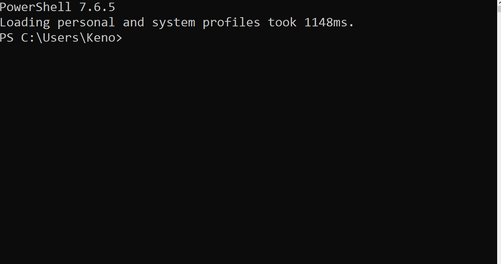

# pacx-predictor

Inline suggestions for [PACX](https://github.com/neronotte/Greg.Xrm.Command) commands and options in PowerShell 7, shown in grey while you type, the way PSReadLine predicts from history.

Community tool, not part of PACX.



## What it does

PACX ships tab completion (`pacx completion powershell`). Tab completion only tells you what is possible after you press TAB. This module adds a PSReadLine predictor that shows the next verb, the required options of the current command or the allowed values of an option *while you type*, including commands you have never used before.

The command tree comes from the installed pacx at runtime (`pacx completion export`), so the suggestions always match your pacx version and include plugin commands. Nothing needs to be regenerated after a pacx update.

## Requirements

- PowerShell 7.4 or newer (the predictor subsystem does not exist in Windows PowerShell 5.1)
- PSReadLine 2.2.2 or newer (bundled with PowerShell 7.4)
- PACX 1.2026.9.249 or newer (first version with `pacx completion export`)

## Install

Until the module is on the PowerShell Gallery, build it from source:

```powershell
git clone https://github.com/Keno-fsdf/pacx-predictor.git
cd pacx-predictor
dotnet publish src/Pacx.Predictor -c Release -o "$HOME\Documents\PowerShell\Modules\Pacx.Predictor"
```

Then, in your pwsh `$PROFILE`:

```powershell
Set-PSReadLineOption -PredictionSource Plugin   # grey text from pacx only; HistoryAndPlugin adds history
Import-Module Pacx.Predictor
```

Importing the module also registers pacx's own TAB completer (the script from `pacx completion powershell`), so you do not need that line in your profile any more.

Keys (PSReadLine defaults on Windows): **TAB** completes the current word and cycles on repeated presses, **Shift+TAB** cycles backwards, **Ctrl+Space** opens a menu, **Right arrow** accepts the grey suggestion, **F2** toggles inline vs. list view.

## Cache

pacx output is cached in `%LOCALAPPDATA%\Pacx.Predictor` (`tree.json`, `completer.ps1`, `meta.json`). The cache is keyed by the pacx executable (path, size, timestamp), so a `dotnet tool update` invalidates it, and it expires after 24 hours to pick up changes pacx cannot signal through its binary, such as added plugins. With a valid cache a new shell starts without running pacx at all. Delete the folder to force a refresh.

## How it works

- `CommandTree` deserializes the JSON printed by `pacx completion export`. Control characters that the console code page can inject into help texts are stripped first.
- `TreeCache` keeps the pacx output on disk; `TreeLoader` uses it when valid and otherwise runs pacx once, keeping the tree in memory so a keystroke never waits for a process.
- `SuggestionEngine` is pure logic (no PowerShell dependency) and mirrors the rules of the pacx tab completer: next verbs, unused options with required ones first, enum values after an option, aliases resolved.
- `PacxPredictor` implements `ICommandPredictor` and is registered when the module is imported.
- On import the module also seeds `$global:PacxCompletionCache`, the cache used by the tab completer from `pacx completion powershell`. pacx locks its history file while running, so two concurrent pacx runs (the predictor's and the completer's first-TAB load) would make one of them fail; seeding the cache means pacx runs exactly once for both.

## Development

```powershell
dotnet test
```

The tests run against a real `pacx completion export` snapshot in `tests/Pacx.Predictor.Tests/fixtures`.

## License

MIT, same as PACX.
