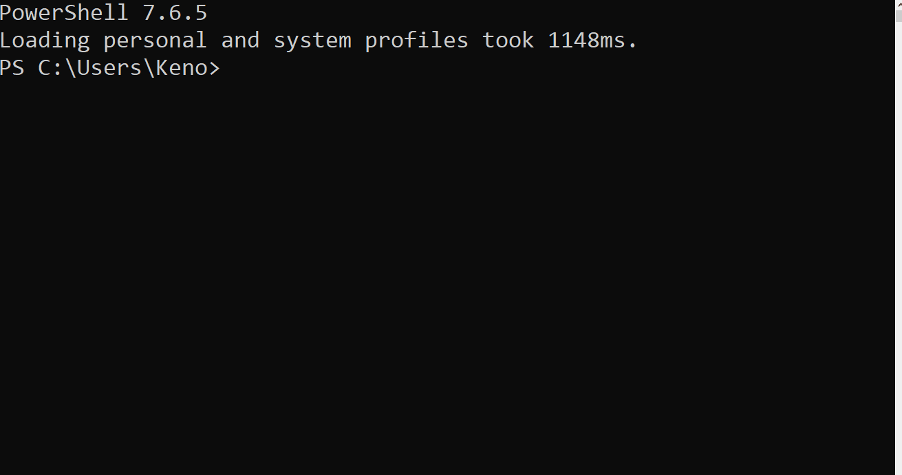

# pacx-predictor

Inline suggestions for [PACX](https://github.com/neronotte/Greg.Xrm.Command) commands and options in PowerShell 7, shown in grey while you type, the way PSReadLine predicts from history.

Community tool, not part of PACX.



## What it does

PACX ships tab completion (`pacx completion powershell`). Tab completion only tells you what is possible after you press TAB. This module adds a PSReadLine predictor that shows the next verb, the required options of the current command or the allowed values of an option *while you type*, including commands you have never used before.

The command tree comes from the installed pacx at runtime (`pacx completion export`), so the suggestions always match your pacx version and include plugin commands. Nothing needs to be regenerated after a pacx update.

## Also: pac

The same predictor covers the [Power Platform CLI](https://learn.microsoft.com/power-platform/developer/cli/introduction) (`pac`). pac has no machine readable command listing and its own `pac complete` only knows the first word, so the tree is built from `pac ... help` pages instead: a few hundred process starts, about two minutes. That is nothing to run behind an interactive shell, so it is never done automatically. Run

```powershell
Update-PacPredictor
```

once after installing, and again after a pac update; it shows progress while it works. Until then `pac` lines simply get no grey text. The result is cached (see below), and from then on a new shell costs nothing.

TAB completion for pac comes with it, from the same tree, so TAB and the grey text always agree. pac has no environment values, so both stop at the option names and fixed values. Deprecated options and the `help` command are left out. `pac org ...`, the older spelling of `pac env ...` that pac still accepts but no longer lists, gets the same treatment.

## Requirements

- PowerShell 7.4 or newer (the predictor subsystem does not exist in Windows PowerShell 5.1)
- PSReadLine 2.2.2 or newer (PowerShell 7.4 ships 2.3.4)
- PACX 1.2026.9.248 or newer (first version with `pacx completion export`)

## Install

Until the module is on the PowerShell Gallery, build it from source (needs the .NET 8 SDK or newer):

```powershell
git clone https://github.com/Keno-fsdf/pacx-predictor.git
cd pacx-predictor
dotnet publish src/Pacx.Predictor -c Release -o "$(Split-Path $PROFILE)\Modules\Pacx.Predictor"
```

Run that in pwsh, so `$PROFILE` points to the PowerShell 7 profile folder and the module lands on its module path.

Then, in your pwsh `$PROFILE`:

```powershell
Set-PSReadLineOption -PredictionSource Plugin   # grey text from pacx only; HistoryAndPlugin adds history
Import-Module Pacx.Predictor
```

Importing the module also registers pacx's own TAB completer (the script from `pacx completion powershell`), so you do not need that line in your profile any more.

Keys (PSReadLine defaults on Windows): **TAB** completes the current word and cycles on repeated presses, **Shift+TAB** cycles backwards, **Ctrl+Space** opens a menu, **Right arrow** accepts the grey suggestion, **F2** toggles inline vs. list view.

## Cache

pacx output is cached in `%LOCALAPPDATA%\Pacx.Predictor` (`tree.json`, `completer.ps1`, `meta.json`). The cache is keyed by the pacx executable (path, size, timestamp), so a `dotnet tool update` invalidates it, and it expires after 24 hours to pick up changes pacx cannot signal through its binary, such as added plugins. With a valid cache a new shell starts without running pacx at all. Delete the folder to force a refresh.

The pac tree lives next to it in `%LOCALAPPDATA%\Pacx.Predictor\pac`, keyed by the installed pac version (the newest `Microsoft.PowerApps.CLI.<version>` folder next to the `pac` shim). After `pac install latest` the key changes and pac suggestions stop until you run `Update-PacPredictor` again. The cache does not expire. `loads.log` in the same folder records for every shell whether the tree came from the cache or why there is none.

## How it works

- `CommandTree` deserializes the JSON printed by `pacx completion export`. Control characters that the console code page can inject into help texts are stripped first.
- `TreeCache` keeps the pacx output on disk; `TreeLoader` uses it when valid and otherwise runs pacx once, keeping the tree in memory so a keystroke never waits for a process.
- `SuggestionEngine` is pure logic (no PowerShell dependency) and mirrors the rules of the pacx tab completer: next verbs, unused options with required ones first, enum values after an option, aliases resolved.
- `PacxPredictor` implements `ICommandPredictor` and is registered when the module is imported.
- `PacHelpParser` reads one `pac ... help` page (usage line, option lines, aliases, `Values:`), `PacTreeBuilder` walks the pages level by level into the same `CommandTree`, `Update-PacPredictor` runs that and caches the result, `PacTreeLoader` only ever reads the cache, and `PacPredictor` (grey text) and `PacCompleter` (TAB, registered on import) serve `pac` lines from it with the same engine.
- On import the module also seeds `$global:PacxCompletionCache`, the cache used by the tab completer from `pacx completion powershell`. pacx locks its history file while running, so two concurrent pacx runs (the predictor's and the completer's first-TAB load) would make one of them fail; seeding the cache means pacx runs at most once for both.

## Development

```powershell
dotnet test
```

The tests run against a real `pacx completion export` snapshot in `tests/Pacx.Predictor.Tests/fixtures`.

## License

MIT, same as PACX.
